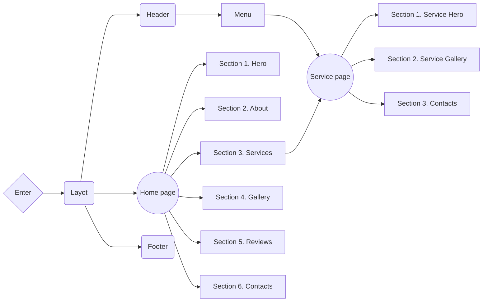

# CONFETTI :tada::balloon::confetti_ball:

**[VIEW LIVE PAGE](https://confetti-event.vercel.app)**

---


## 📝 Project description

A website for the **Confetti** service company.

- **Project name**: Confetti
- **Project goals**:
  - Creating a positive personal brand image
  - Attracting new customers / partners
  - Promoting services through website
  - Informing consumers
- **Target audience**:
  - **Age**: 20-45+
  - **Gender**: Female
- **Product scope**: Development of a multi-page website for the Confetti
  company, whose main field of activity is creating decorations for parties and
  events.

## 🛠️ Creating the project

**Confetti** is a [Next.js](https://nextjs.org/) project bootstrapped with
[`create-next-app`](https://github.com/vercel/next.js/tree/canary/packages/create-next-app).

### Features

- **Optimization**: The website is optimized for fast loading, providing users
  with quick access to information.
- **Modularity and reusability**: The product is built using a component
  approach, which makes the code modular and allows components to be used on
  different pages and in different sections of the project. This simplifies the
  maintenance of the site and the expansion of its functionality.
- **Linters and formatting**: Using tools like Prettier and ESLint helps
  maintain code standards, ensures a consistent style, and identifies potential
  problems in the code.
- **Adaptability**: The website is responsive, allowing you to create dynamic
  and interactive user interfaces without reloading pages. This increases user
  engagement and interaction.
- **Convenient content management**: The content management system has an
  intuitive interface that simplifies the process of updating and editing
  content. You can easily make changes to texts, images and other content
  without special knowledge in web development.
- **Accessibility**:
  - Intuitive design
  - Semantic HTML
  - Mobile-friendly interface
  - Web resource available for any internet connection

### Supported Languages

- Polish

### Design

[Design layout on Figma](https://www.figma.com/file/0PqCf8xZ4MGEE8VVc3AqL1/Confetti?type=design&node-id=279-2993&mode=design&t=JFAEXE7O02SadGTS-0)

### Project structure



<details>

<summary><b>Project Organization and File Colocation: </b></summary>

<br/>

```

|-- public -> static files
|-- src -> source directory with the main application code
  |-- app -> pages and routing
    |-- (site) --> routing group for main UI
    |-- (studio) --> routing group for embedded CMS
  |-- components -> folder with reusable components
    |-- base -> base sections/block components (form, menu, etc.)
    |-- ui -> small reusable components (button, logo, etc.)
      |-- NameComponent -> folders for each component
        |-- NameComponent.tsx -> main component
        |-- index.ts -> file for re-export
        |-- types.ts -> file for special components types (props)
  |-- layout -> components that are used as a main template
  |-- sections -> folder with section components
  |-- sanity -> folder with base CMS code
    |-- requests --> recieving dynamic data
    |-- schemas --> schemas for CMS data modeling
  |-- data -> static data for the project (json)
  |-- types -> folder with reusable type definitions
  |-- utils -> additional reusable functions
    |-- helpers -> helper functions for pages & components
    |-- hooks -> folder with custom hooks

```

</details>

### Components API

Each component has its own API. You can find it in the component's folder. This
is a list of more common components and their API.

- #### ExampleComponent

| Prop        | Default     | Description                                   |
| ----------- | ----------- | --------------------------------------------- |
| `text`      | `undefined` | required, inner text content                  |
| `className` | `''`        | add custom or additional css class you'd need |

- #### Logo

| Prop        | Default     | Description                                                                       |
| ----------- | ----------- | --------------------------------------------------------------------------------- |
| `location`  | `undefined` | required, choose the position you'd need to define image size: `header`, `footer` |
| `className` | `''`        | add custom or additional css class you'd need                                     |
| `onClick`   | `undefined` | optional, add `:void` function to add side effects you'd need on click            |

- #### ContactLinks

| Prop        | Default     | Description                                           |
| ----------- | ----------- | ----------------------------------------------------- |
| `location`  | `undefined` | Choose the position you'd need: `header`or `contacts` |
| `className` | `undefined` | add any custom styles                                 |

- #### SectionTitle

| Prop          | Default     | Description                                         |
| ------------- | ----------- | --------------------------------------------------- |
| `children`    | `undefined` | required, `ReactNode` embedded components or `text` |
| `accentColor` | `undefined` | applies the `accent` text color option              |
| `center`      | `undefined` | centers text                                        |
| `className`   | `undefined` | add string custom styles                            |

- ### Slider Controls

| Prop      | Default     | Description                            |
| --------- | ----------- | -------------------------------------- |
| `section` | `undefined` | required, only `services` or `reviews` |

- #### Slider

| Prop             | Default     | Description                                                 |
| ---------------- | ----------- | ----------------------------------------------------------- |
| `data`           | `undefined` | required, any `array` of data for mapping                   |
| `className`      | `''`        | add any custom styles of .swiper element                    |
| `slideClassName` | `''`        | add any custom styles of .swiper-slide element              |
| `component`      | `undefined` | required, the element that will be placed inside the slide' |
| `section`        | `undefined` | required, `about`, `services`, `gallery`, `reviews`;        |

- #### ContactFormInput

| Prop                | Default     | Description                                                                       |
| ------------------- | ----------- | --------------------------------------------------------------------------------- |
| `config`            | `undefined` | required, object with required string fields: `required`, `name`, `label`,        |
|                     |             | `placeholder`, `isRequaredField`, `errorMessage` and `validationOptions`.         |
|                     |             |                                                                                   |
| `name`              | `undefined` | required, `string`, input value name                                              |
| `label`             | `undefined` | required, `string`, label value                                                   |
| `placeholder`       | `undefined` | required, `string`, input placeholder value                                       |
| `isRequaredField`   | `undefined` | required, `boolean`, enables validation and marks the field                       |
|                     |             | as required                                                                       |
| `errorMessage`      | `undefined` | required, `string` validation error text                                          |
| `validationOptions` | `undefined` | required, object with optional string fields: `pattern`, `maxLength`, `minLength` |

- #### ContactFormTextarea

| Prop                | Default     | Description                                                                |
| ------------------- | ----------- | -------------------------------------------------------------------------- |
| `config`            | `undefined` | required, object with required string fields: `required`, `name`, `label`, |
|                     |             | `placeholder` and `validationOptions`.                                     |
|                     |             |                                                                            |
| `name`              | `undefined` | required, `string`, textarea value name                                    |
| `label`             | `undefined` | required, `string`, label value                                            |
| `placeholder`       | `undefined` | required, `string`, textarea placeholder value                             |
| `validationOptions` | `undefined` | required, object with optional string fields: `maxLength`                  |

- #### ReviewsCard

| Prop        | Default     | Description                                                                    |
| ----------- | ----------- | ------------------------------------------------------------------------------ |
| `className` | `' '`       | add any custom string styles                                                   |
| `card`      | `undefined` | required, item of array, should contain `id`, `review`, `name` as string field |

- #### GalleryCard

| Prop        | Default     | Description                                                                                                |
| ----------- | ----------- | ---------------------------------------------------------------------------------------------------------- |
| `className` | `' '`       | add any custom string styles                                                                               |
| `card`      | `undefined` | required, image props as object with fields: `alt`, `path` & `pathCrop` (optional) for small image version |
| `grid`      | `false`     | optional, to add tabIndex and make element interactive on keyboard                                         |
| `onClick`   | `undefined` | function to handle `click` event on element                                                                |

### Technology stack

- **Main technologies**:

  - Next.js (app router)
  - TypeScript
  - Tailwind CSS
  - Sanity CMS (backend, embedded management system)

- **Additional dependencies**:

  - Swiper
  - React Hook Form
  - Nodemailer
  - React Scroll
  - Yet Another React Lightbox
  - Framer Motion
  - React Email

  ...full list of dependencies is available in `package.json` file.

## 📂 Deployment

To deploy this project, you need to perform the following steps:

1. **Clone the repository**: Use the `git clone` command to clone this
   repository to your computer.
2. **Install the dependencies**: Open a terminal in the root of the project and
   run `npm install` or `yarn install` to install all required dependencies.
3. **Setting environment variables**: Create a `.env` file in the root folder
   and add the necessary environment variables that you need for the project
   according to the `.env.example` file.
4. **Run the application**: Run the `npm run dev` or `yarn dev` command to run
   the project on the local server.
5. **Deploy**: To deploy this project to a production server, use hosting
   platforms such as Vercel, Netlify, or others.

## ☎️ Contacts

**SoftRyzen** is ready to answer your questions and provide additional
information:

- **Website**: [softryzen.com](https://softryzen.com/)
- **Phone**: <a href="tel:+380979769625">+380979769625</a>
- **Email**: [services@softryzen.com](mailto:services@softryzen.com)
- **YouTube channel**:
  [https://www.youtube.com](https://www.youtube.com/watch?v=_X7NLwgdfgI)
